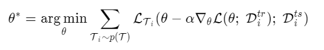
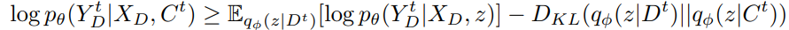

# Implementation of Meta Learning Algorithm(Pytorch)

1. Model-Agnostic Meta-Learning for Fast Adaptation of Deep Networks([Paper](https://arxiv.org/abs/1703.03400))
   
   This paper proposed simple, but effective gradient-based meta-learning algorithms called MAML. MAML tries to train model's initial parameters such that the model has a maximal performance on a new task after the parameters have been updated through one or more gradient steps computed with a small amount of data from that new task.

   Formally, the meta-objective of MAML algorithm can be written as below:
   
   
   
   We optimize the meta-objective via gradient descent. Although this requires an additional backward pass, it is supported by Pytorch or Tensorflow

   Below figures show the results of MAML compared to pure pretrained model in regression and reinforcement learning, which is almost same dataset and environment proposed in the paper. As shown in figures, MAML can learn quickly to adapt new task with a small number of gradient update than pure pretrained model.

   - Regression

   
   
   - Reinforcement Learning

   

2. Neural Processes([Paper](https://arxiv.org/pdf/1807.01622.pdf))

   Neural Processes(NP) combine the strengths of neural networks and Gaussian processes  to achieve both flexible learning and fast prediction in stochastic processes.

   Formally, NP tries to maximize the Evidence Lower Bound(ELBO) dervied as below:

   

   Since NP are trained to predict distribution over functions, it can be considered as Meta-Learning algorithm. NP can quickly adapt function which is unseen but sampled from same distribution with functions that are used in training. Therefore, I implement Neural Process algorithm and apply to regression and reinforcement learning tasks.
